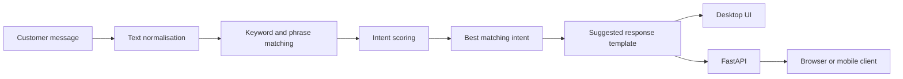

# Comment Synthesizer


A Python-based, explainable rule-based response-assistance prototype for synthesising suggested replies to electricity-service messages about loadshedding, outages, billing, power interruptions and related topics.

> **Independent prototype:** This project is not an official Eskom product and is not affiliated with or endorsed by Eskom. It does not use live Eskom operational data. Generated output is a suggested response template and must not be interpreted as confirmation of current grid conditions, outage status, restoration times, tariffs or account information.


## What the system does

Comment Synthesizer normalises an incoming message, expands curated keyword variants, optionally enriches intent vocabulary with WordNet, scores matching intents, and selects a deterministic response template. The same response engine is exposed through a Tkinter desktop interface and a FastAPI endpoint.

The current implementation is **rule-based and deterministic**. It does not use a trained machine-learning model, large language model or generative-AI API.

## Architecture



## Features

- Detects common electricity-service themes such as loadshedding, outages, billing, vandalism and no-power events.
- Normalises case, punctuation, hyphenation and common phrase variants.
- Uses curated intent vocabulary with optional WordNet synonym enrichment.
- Applies deterministic scoring so specific phrases can outrank generic words.
- Provides a helpful fallback when no intent is confidently matched.
- Shares one response engine across desktop, API and browser/mobile examples.
- Includes automated unit tests and GitHub Actions CI.
- Supports Windows packaging with PyInstaller.

## Project layout

| Path | Purpose |
| --- | --- |
| `comments_generation_wordnet_rulebased.py` | Core normalisation, intent matching and response-template logic |
| `app.py` | Tkinter desktop interface |
| `api.py` | FastAPI interface |
| `web_app.html` | Browser demonstration |
| `web_app_react.html` | Alternate browser-style chat demonstration |
| `mobile_api_example.dart` | Example Dart API client |
| `test_comments_generation.py` | Automated validation tests |
| `research/` | Historical research/analysis scripts; datasets are not included |
| `.github/workflows/python-tests.yml` | Continuous-integration test workflow |

## Quick start

### 1. Create a virtual environment

```powershell
python -m venv .venv
.\.venv\Scripts\Activate.ps1
python -m pip install --upgrade pip
pip install -r requirements.txt
```

### 2. Run the desktop application

```powershell
python app.py
```

### 3. Run the API

```powershell
python -m uvicorn api:app --host 127.0.0.1 --port 8000
```

Then use the local API at `http://127.0.0.1:8000`. The included browser examples are configured for this local endpoint.

### 4. Run the tests

```powershell
python -m unittest -q
```

## API

### Health check

`GET /health`

### Generate a suggested response

`POST /respond`

Example request:

```json
{
  "message": "there is a power outage in my area"
}
```

The API accepts a non-empty message of up to 1,000 characters and returns the selected suggested response template.

## Methodology and limitations

The engine is a lightweight symbolic NLP prototype. Matching quality depends on the manually defined intent vocabulary, phrase normalisation and scoring heuristics. WordNet can enrich the vocabulary when its corpus is installed, but the curated vocabulary remains functional without it.

The system does **not** verify a user's location, account, outage, loadshedding stage, restoration estimate, tariff or any other live operational fact. Human review is appropriate before using generated templates in real customer communication.

The `research/` directory contains historical analysis code that references local/Colab dataset paths. The underlying datasets are intentionally not distributed in this repository.

## Security and privacy

- No credentials or operational datasets are required for the core application.
- Local environment files, private keys, spreadsheets and common dataset formats are excluded by `.gitignore`.
- The demonstration API does not implement authentication and should not be exposed directly to the public internet without an appropriate production gateway, authentication/authorisation, rate limiting, restricted CORS and deployment hardening.
- The API does not intentionally persist submitted messages.

See [SECURITY.md](SECURITY.md) for responsible reporting and deployment notes.

## Licence

Released under the [MIT License](LICENSE).

## Author

**Peter Olujimi**

This repository presents the software-engineering and explainable NLP prototype for public review and extension.
